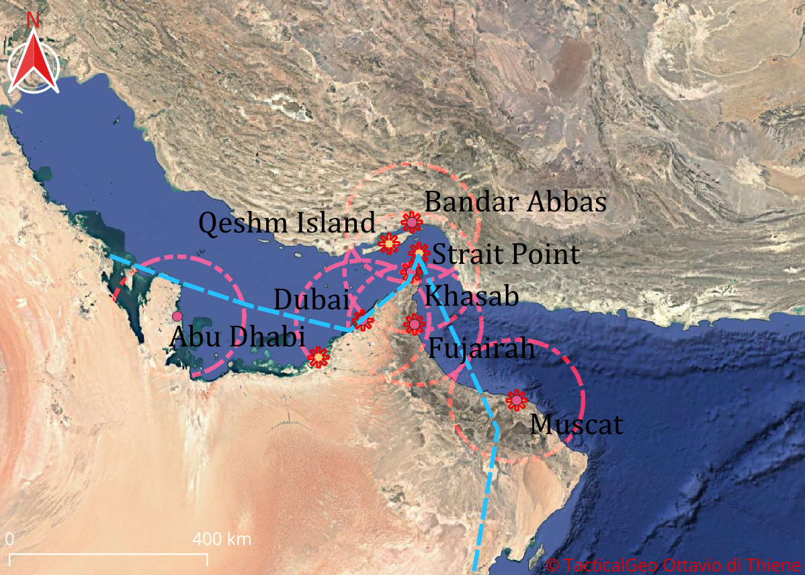

Geospatial intelligence system for the Strait of Hormuz

## What it does
- Processes real geographic data with Python + GeoPandas
- Generates strategic bases, shipping lanes, buffer zones
- Serves data via Flask REST API
- Visualizes layers in QGIS on satellite imagery

## API Endpoints
| Endpoint | Description |
|---|---|
| GET / | API status |
| GET /api/bases | All strategic bases |
| GET /api/bases/naval | Naval bases only |
| GET /api/bases/<name> | Specific base data |
| GET /api/stats | Statistics by type |

## Tech Stack
Python · GeoPandas · Flask · SQLite · QGIS · GeoJSON

## Screenshots

## How to run
pip install flask geopandas
python flask_intro.py

## Author
Ottavio di Thiene — Hamburg, Germany
